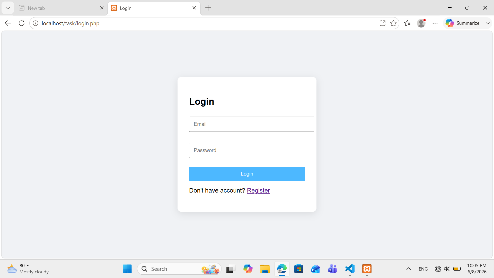
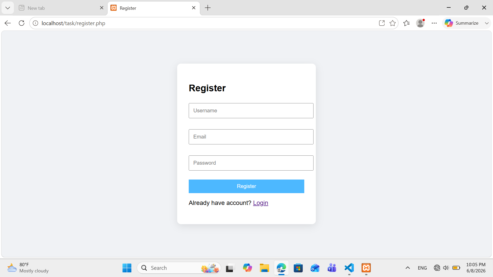
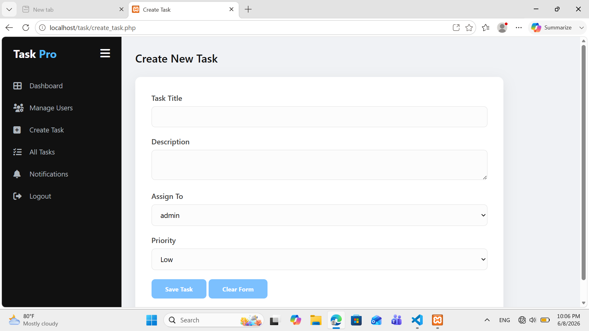
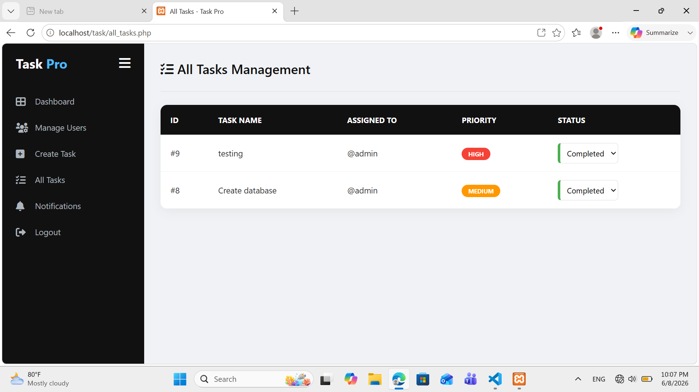
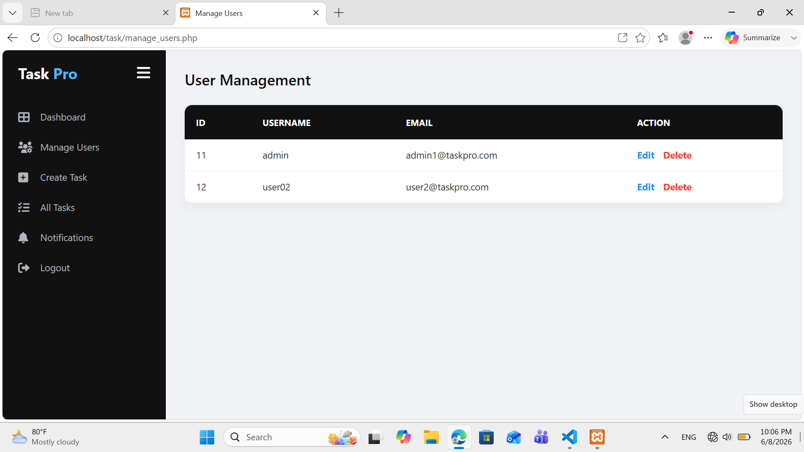
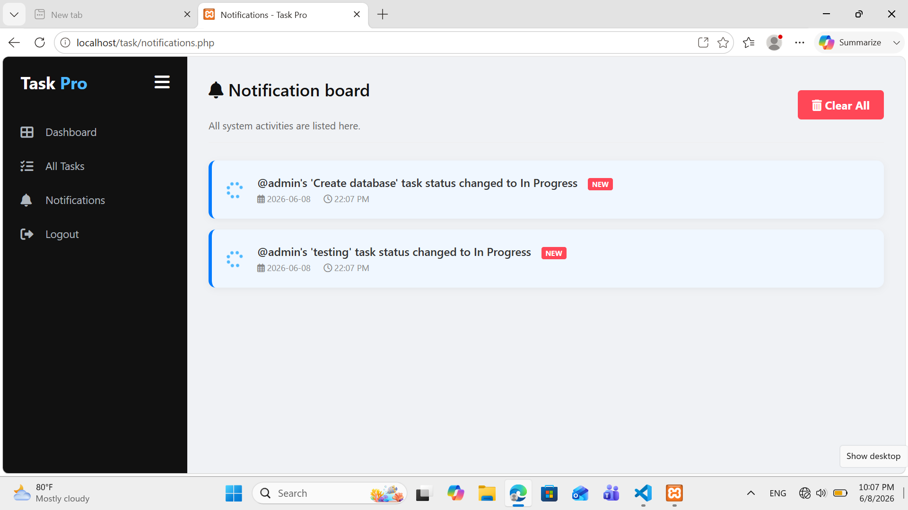
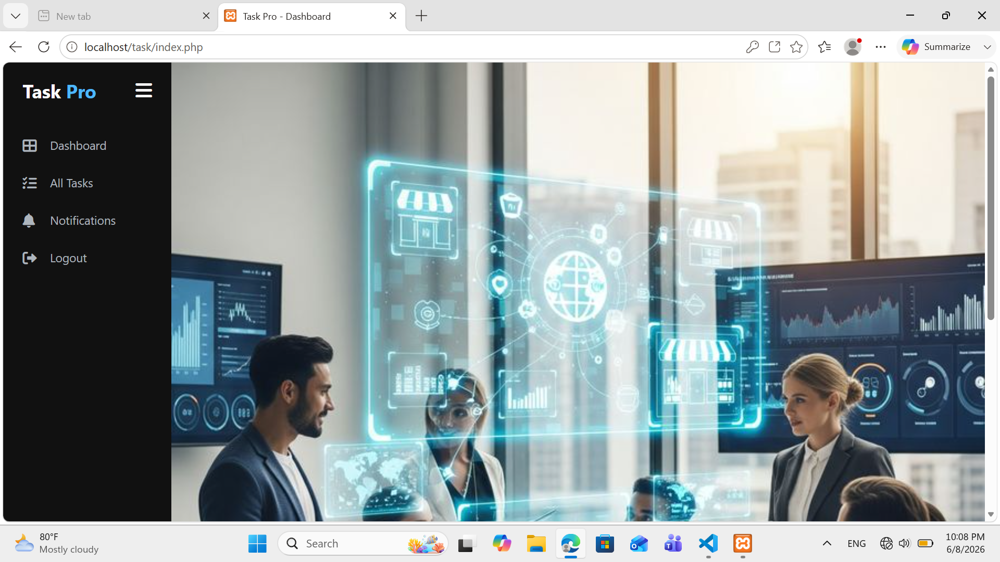

# 🚀 Task Pro - Task Management System

A modern web-based Task Management System developed using **PHP** and **MySQL** that enables administrators to manage users, assign tasks, track task progress, and monitor system notifications efficiently.

---

## 📖 Overview

Task Pro is designed to simplify task management within an organization. Administrators can create tasks, assign them to users, manage user accounts, and monitor task progress through an interactive dashboard. Users can update task status, while the system automatically generates notifications for every important activity.

---

## ✨ Features

- 🔐 Secure User Authentication
- 👤 User Registration & Login
- 🛡️ Role-Based Access Control (Admin/User)
- 👥 User Management
- ➕ Task Creation & Assignment
- 📋 Task Status Management
- 🔄 Real-Time Status Updates
- 🔔 Notification System
- 🎯 Priority Levels (Low / Medium / High)
- 🎨 Modern Glassmorphism User Interface
- 📱 Responsive Design

---

## 🛠️ Technologies Used

- PHP
- MySQL
- HTML5
- CSS3
- JavaScript
- Font Awesome
- MySQLi (Prepared Statements)

---

## 📂 Project Structure

```text
task-pro/

│── all_tasks.php
│── create_task.php
│── manage_users.php
│── notifications.php
│── update_status_logic.php
│── clear_notifications.php
│── login.php
│── register.php
│── logout.php
│── index.php
│── sidebar.php
│── db_config.php
│── style.css
│── login.css
│── img.jpg
│── task_pro_db.sql
│
└── Screenshots/
    ├── login.png
    ├── dashboard.png
    ├── create_task.png
    ├── all_tasks.png
    ├── manage_users.png
    └── notifications.png
```

---

## ⚙️ Installation Guide

1. Clone or download this repository.
2. Move the project folder to the **htdocs** folder in XAMPP.
3. Open **phpMyAdmin**.
4. Create a database named **task_pro_db**.
5. Import the **task_pro_db.sql** file.
6. Update database credentials in **db_config.php** if necessary.
7. Start Apache and MySQL.
8. Open your browser and visit:

```text
http://localhost/task-pro/
```

---

## 📸 Screenshots

### Login Page



### Register Page



### Admin Dashboard


### Create Task



### All Tasks



### Manage Users



### Notifications



### User dashboard



---

## 🎯 Main Modules

- User Authentication
- Role-Based Access Control
- User Management
- Task Creation
- Task Assignment
- Task Status Management
- Notification System
- Dashboard

---

## 🔒 Security Features

- Password Hashing
- Prepared Statements
- Session Management
- Role-Based Authorization
- SQL Injection Protection

---

## 💡 Future Improvements

- Email Notifications
- Task Deadlines
- File Attachments
- Search & Filter Tasks
- Dashboard Analytics
- PDF Report Generation
- User Profile Management

---

## 👩‍💻 Developer

**Lakshi Sewmini**

Aspiring Software Developer passionate about building secure and user-friendly web applications using PHP and MySQL.

---

## ⭐ Support

If you found this project useful, please consider giving it a **Star** on GitHub.
